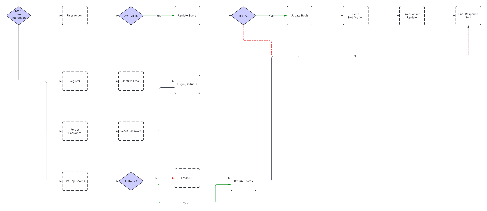

# Scoreboard API Module

This module is designed to manage and update a live scoreboard for a website, ensuring secure and real-time updates of users' scores.

## Features

- Display top 10 user scores.
- Real-time score updates using Socket.io.
- Secure score updates to prevent unauthorized modifications.

## API Endpoints

### Register API (`/api/register`)

- **Description**: Registers a new user with an email and password. If the email is already in use and activated, it returns an error. If the email exists but is not activated, a confirmation email is resent. Otherwise, it creates a new user, sends a confirmation email, and returns a success message.
- **Request**:
  - `POST /api/register`
  - Body: `{ "email": "user@example.com", "password": "securepassword" }`
- **Response**:
  - `200 OK`: A confirmation email is sent.
  - `400 Bad Request`: Email already exists and is activated.
  - `400 Bad Request`: Email exists but is not activated, confirmation email resent.

### Confirm API (`/api/confirm`)

- **Description**: Confirms the user's email address using a token sent during registration. If the token is valid and not expired, the user's account is activated.
- **Request**:
  - `GET /api/confirm?token=yourtoken`
- **Response**:
  - `200 OK`: Email successfully activated.
  - `400 Bad Request`: Token is expired or email is already activated.

### Login API (`/api/login`)

- **Description**: Authenticates a user with their email and password. On successful authentication, a JWT token is returned for managing the session.
- **Request**:
  - `POST /api/login`
  - Body: `{ "email": "user@example.com", "password": "securepassword" }`
- **Response**:
  - `200 OK`: JWT token returned.
  - `401 Unauthorized`: Email or password is incorrect.

### OAuth2 Login API (`/api/oauth2/login`)

- **Description**: Authenticates a user using an OAuth2 access token. If authentication is successful, a JWT token is returned.
- **Request**:
  - `POST /api/oauth2/login`
  - Body: `{ "accessToken": "oauth2token" }`
- **Response**:
  - `200 OK`: JWT token returned.
  - `400 Bad Request`: Email cannot be retrieved or other errors occur.

### Forgot API (`/api/forgot`)

- **Description**: Initiates the password reset process by sending a reset email if the provided email exists in the system.
- **Request**:
  - `POST /api/forgot`
  - Body: `{ "email": "user@example.com" }`
- **Response**:
  - `200 OK`: Reset email sent.
  - `400 Bad Request`: Email does not exist.

### Reset Password API (`/api/reset`)

- **Description**: Resets the user's password using a reset token. If the token is valid and not expired, the password is updated.
- **Request**:
  - `POST /api/reset`
  - Body: `{ "token": "resetToken", "email": "user@example.com", "newPassword": "newsecurepassword" }`
- **Response**:
  - `200 OK`: Password successfully reset.
  - `400 Bad Request`: Token is expired or invalid.

### Get Top API (`/api/top`)

- **Description**: Retrieves the top 10 users with the highest scores from the database. If the top_scores key does not exist in Redis, it will be created and populated with the top user list. If the top_scores key already exists in Redis, the data will be retrieved from there and returned to the user.
- **Request**:
  - `GET /api/top`
- **Response**:
  - `200 OK`: Returns a list of the top 10 users and their scores.

### Action API (`/api/action`)

- **Description**: Checks if the JWT is valid; if not, the process is skipped. If valid, the user's score is increased in the database upon successful action execution. The top 10 scores stored in Redis are then checked. If the new score is higher than any existing entry in the top 10, it is inserted into the list, sorted in descending order, and the lowest score is removed. The updated ranking is sent via the API notification to update the frontend display. If the new score is not higher than any in the top 10, it is ignored.
- **Request**:
  - `POST /api/action`
  - Headers: `Authorization: Bearer <jwt_token>`
  - Body: `{ "actionData": "some_data" }`
- **Response**:
  - `200 OK`: Score updated and top 10 list refreshed.
  - `401 Unauthorized`: JWT is invalid or not found in Redis.

### Notification API (`/api/notification`)

- **Description**: Sends real-time updates of the highest-scoring user, provided by the Action API, to the frontend. The frontend adds the user to the top 10 list on the dashboard, removes the lowest-scoring entry, and sorts the list in ascending order.
- **Request**:
  - **WebSocket** connection required.
- **Response**:
  - **WebSocket Event**: `Notification` with updated data.

## How the API Works

1. **User Registration & Confirmation**:
  - Users register by providing an email and password via the /api/register endpoint.
  - If the email is already in use and activated, an error is returned. If it exists but is not activated, a confirmation email is resent.
  - A confirmation email with a token is sent, and the user confirms their email via /api/confirm?token=yourtoken.
  - Upon successful confirmation, the user's account is activated.

2. **User Login & OAuth2 Login**:
  - Users authenticate using their email and password via /api/login.
  - Alternatively, users can log in via OAuth2 using an access token through /api/oauth2/login.
  - Successful authentication returns a JWT token, which is used for managing user sessions.

3. **Password Management**:
  - If a user forgets their password, they can request a reset link via /api/forgot, which sends a reset email if the email exists in the system.
  - Users reset their password using the token provided in the email via /api/reset.

4. **Score Management**:
  - Users perform actions that impact their scores through /api/action.
  - The API validates the user's JWT token before processing the action.
  - If valid, the user's score is updated in the database.
  - The system checks the top 10 scores stored in Redis:
    + If the new score is higher than any in the top 10, it is inserted, the list is sorted in descending order, and the lowest score is removed.
    + If the score does not exceed any in the top 10, it is ignored.
  - The updated leaderboard is sent via API notification to refresh the frontend.

5. **Retrieving Top Scores**
  - The /api/top endpoint retrieves the top 10 users with the highest scores.
  - If the top_scores key does not exist in Redis, it is created and populated from the database.
  - If the top_scores key exists, data is retrieved from Redis for a faster response.

6. **Notifications**:
  - High-score updates are sent in real time via WebSocket connections using Socket.io.
  - When a user achieves a top 10 score, an event is triggered, updating the top 10 list on the frontend dashboard.
  - The lowest-scoring entry is removed, and the list is re-sorted in ascending order.
  - The new top 10 list is broadcast to all connected clients.

## Database Design

### User Table

- **Table Name**: `users`
- **Fields**:
  - `id` (Primary Key, Auto Increment)
  - `email` (Unique, VARCHAR)
  - `password` (VARCHAR)
  - `activated` (BOOLEAN, Default: FALSE)
  - `created_at` (TIMESTAMP)
  - `updated_at` (TIMESTAMP)

### Email Confirmation Table

- **Table Name**: `email_confirmations`
- **Fields**:
  - `id` (Primary Key, Auto Increment)
  - `user_id` (Foreign Key to `users.id`)
  - `token` (VARCHAR)
  - `expires_at` (TIMESTAMP)
  - `created_at` (TIMESTAMP)

### Password Reset Table

- **Table Name**: `password_resets`
- **Fields**:
  - `id` (Primary Key, Auto Increment)
  - `user_id` (Foreign Key to `users.id`)
  - `token` (VARCHAR)
  - `expires_at` (TIMESTAMP)
  - `created_at` (TIMESTAMP)

### Scores Table

- **Table Name**: `scores`
- **Fields**:
  - `id` (Primary Key, Auto Increment)
  - `user_id` (Foreign Key to `users.id`)
  - `score` (INTEGER)
  - `updated_at` (TIMESTAMP)

### Redis Cache Design

- **Key for Top Scores**: `top_scores`
  - **Type**: Sorted Set
  - **Score**: User score
  - **Member**: User ID

## Diagram

Below is a diagram illustrating the flow of execution for the APIs:

## Comments for Improvement

1. **Security Enhancements**
   - Rate Limiting: Implement rate limiting using tools like \`express-rate-limit\` in Node.js to prevent abuse.
   - HTTPS: Configure HTTPS using SSL/TLS certificates to secure communication.
   - Input Validation: Use validation libraries like \`joi\` or \`validator\` to ensure input data is clean and secure.

2. **Scalability**
   - Distributed Database: Consider using databases like Cassandra or MongoDB for better scalability.
   - Message Queues: Implement RabbitMQ or Kafka for handling asynchronous tasks and high traffic.

3. **Monitoring and Logging**
   - Logging: Use \`winston\` or \`morgan\` for logging in Node.js applications.
   - Monitoring: Integrate Prometheus for monitoring metrics and Grafana for visualizing them.

4. **Testing**
   - Unit Testing: Use testing frameworks like \`jest\` or \`mocha\` for unit tests.
   - Integration Testing: Use tools like \`supertest\` for testing API endpoints.
   - Load Testing: Use tools like \`k6\` or Apache JMeter to simulate high traffic and test system performance.
   - Security Testing: Use tools like OWASP ZAP or Burp Suite for security testing.

5. **Documentation**
   - API Documentation: Use Swagger to auto-generate API documentation.
   - Setup Instructions: Provide clear and detailed setup instructions, including environment setup and dependency installation.
   - Usage Examples: Include common usage examples and scenarios in the documentation to help developers get started quickly.
6. **Separation of Notification API**:
   - Separate the Notification API into its own dedicated broker and adopt a microservices architecture. This approach will improve connection management and stability for Socket.io by using sticky sessions.

---

This specification is provided for the backend engineering team to implement the required functionality for the Scoreboard API Module. For any clarifications or further details, please refer to the comments section or contact the project manager.
